# Platinum Supps
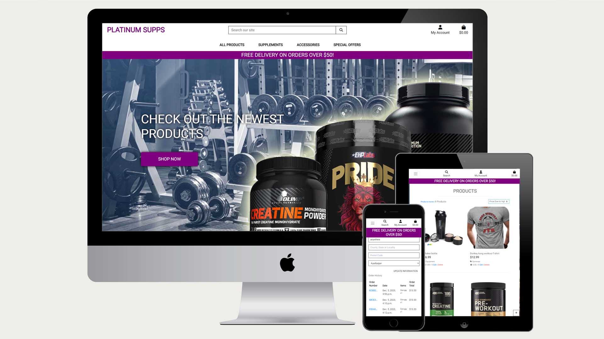

## Code institute milestone project four

**[Deployed site click here](https://platinum-supps-a69b518ec505.herokuapp.com/)**
---

Welcome to Platinum Supps! your fitness ally and premium supplement and gym equipment haven. At Platinum Supps, we're dedicated to fueling your fitness journey with top-quality products. From science-backed supplements to cutting-edge gym gear, we've got your back. embrace the excellence, and let's achieve your fitness goals together. Welcome to Platinum Supps – where strength meets style!

Features

1. Profile Creation
   Create a profile that will hold you personal details for sales and products

2. Product browsing
   Search through the sites wares with easy navigation and filters that allow you to display by multiple factors such as price or rating

3. Search bar
   Search through the entire database of products for specifc values such as name or even things mentioned in the descriptio 

4. Admin controls
   When set up as an admin control the products on display with the ability to delete or edit products details and images

5. checkout
   make fast payments with stripe checkout handling credit card and billing details

6. Promo codes
   Add a discount to specific products with promocodes that you can set and apply

7. Wish list
   Add products to a wish list for future browsing and purchase

8. Email
   Recieve an automated email upon purchase containing the information of your purchase
   

### User Stories

### As a new customer:

- Understand the purpose of the site as soon as it loads
- Easily browse the products on the site
- Create an account
- Learn about a products detials
- Search through the database of products 
- Add products to a wish list
- Choose the size of product that im purchasing
- View my previous purchases
- Recieve a confirmation for my order
- See which products are on sale or clearence
- Check my basket before checking out
- Be able to create a new account as simply as possible taking a username and password 
- save my default information for future purchases

### As the business owner:

- Be able to add new products to the site as well as edit existing ones
- Have a way to implement discount codes for certain products
- have a simple payment structure

### Strategy

Create a fully functional e-commerce website that will provide the means to create an account, browse through a variety of products in different categories and add them to a basket for purchase.

as well as add those products to a wishlist and have the option to apply promo codes at checkout

## Structure of the website

Platinum supps comprises of a homepage that grants acccess to all areas of the site, a Registration page that allows a user to make an account that will track their details and purchases.

a wishlist that the user can save specific products too and a bag/checkout that will calculate the total of the purchase, workout whether it qualifies for free delivery and then handles creditcard payments

## Wireframes

I used balsamiq to create the initial wireframes.

### Home Wireframes

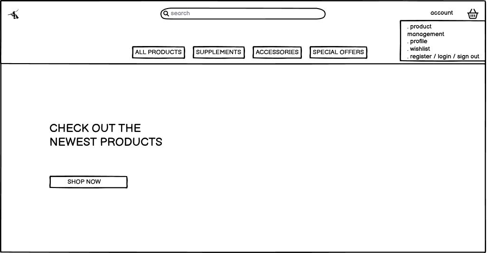

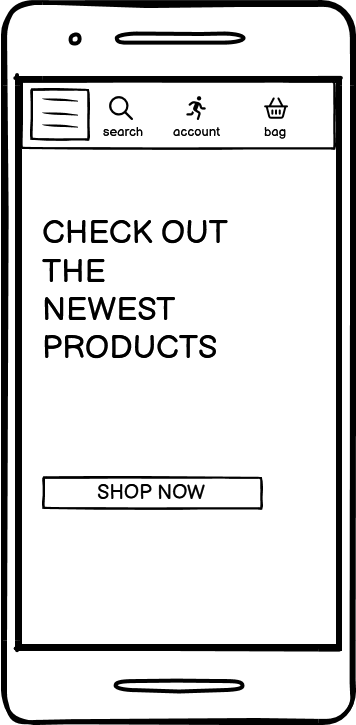

### Products Wireframes

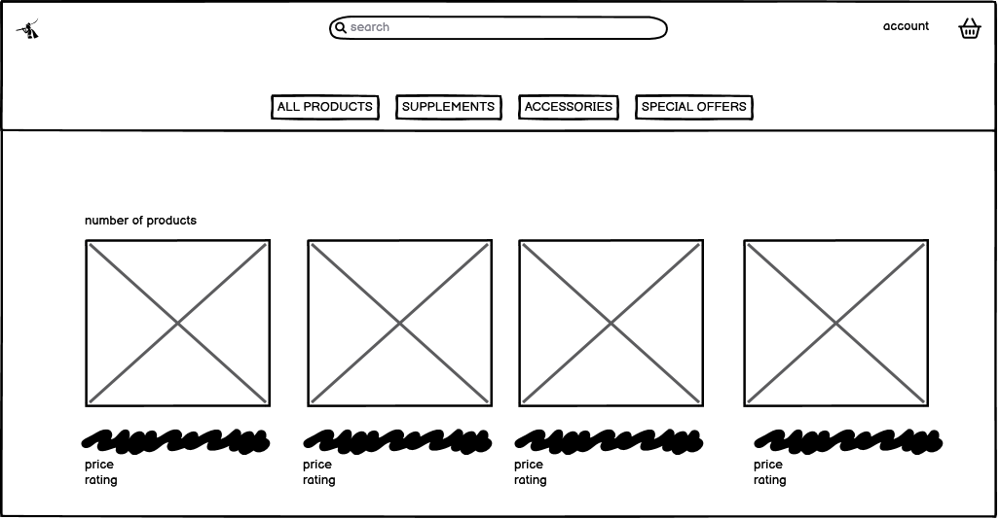

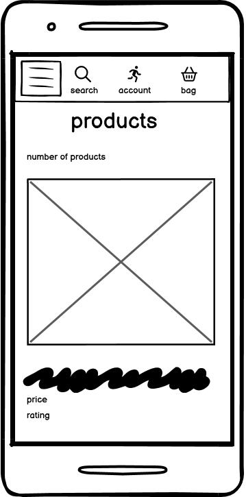

### Product Details Wireframes

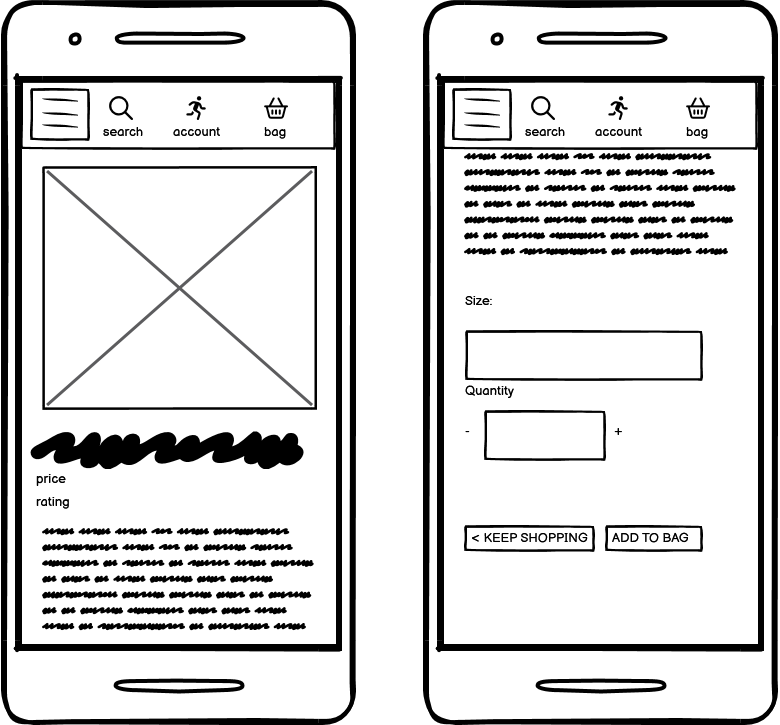

### Bag Wireframes

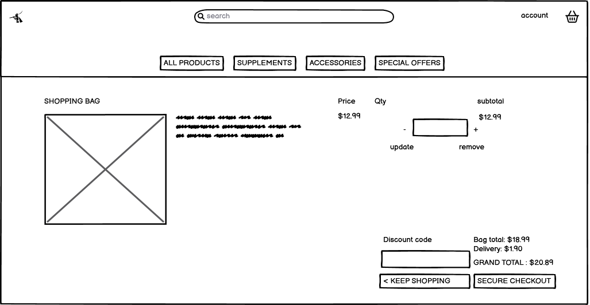

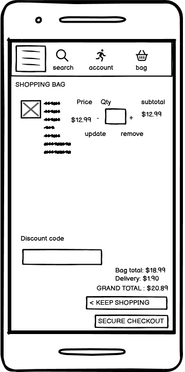

### Checkout Wireframes

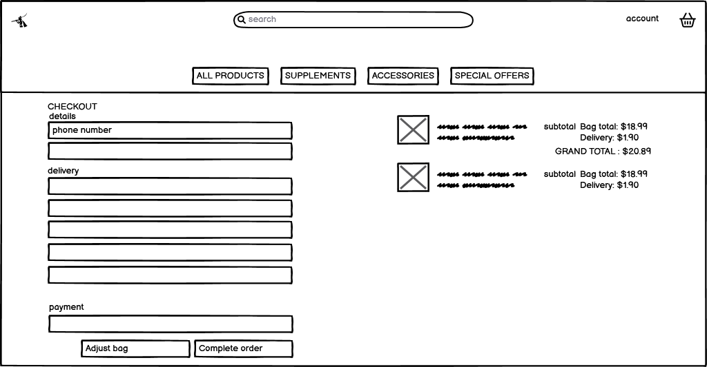

### Wishlist Wireframes

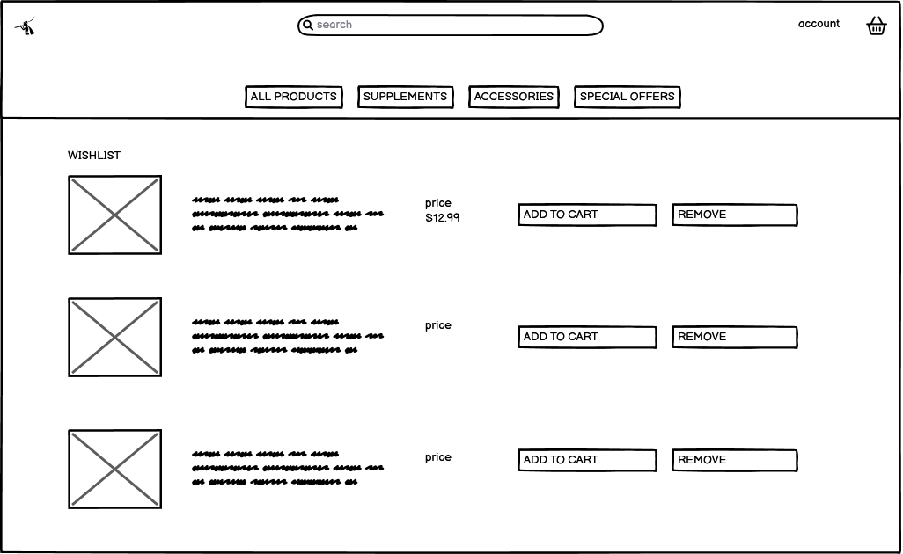

### Profile Wireframes

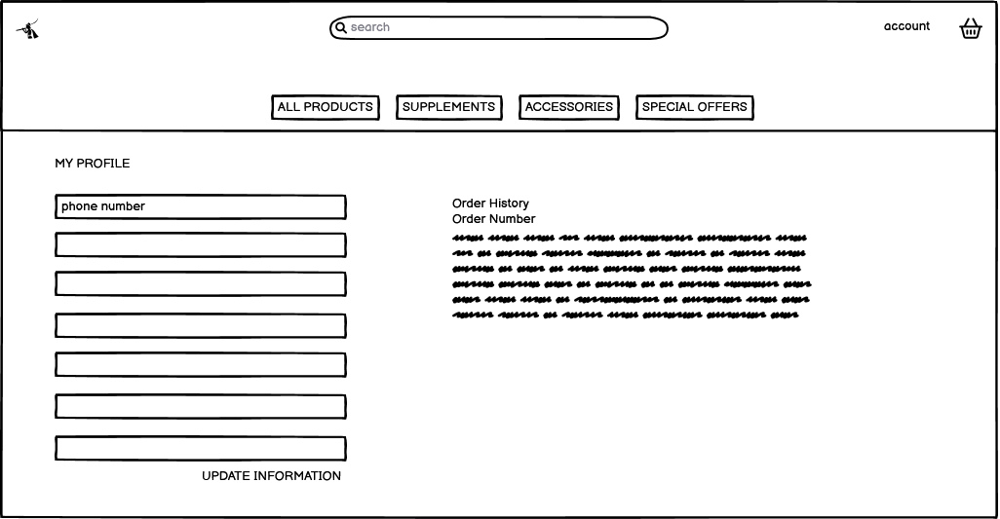

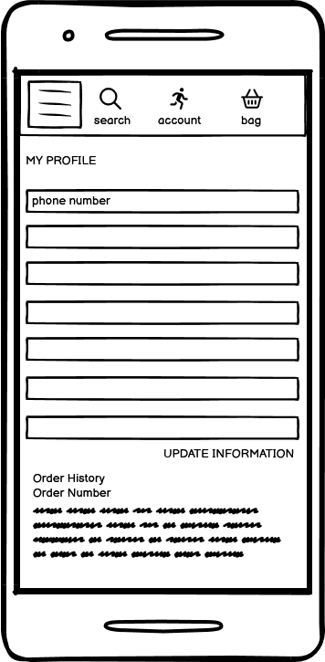

### Registration Wireframes

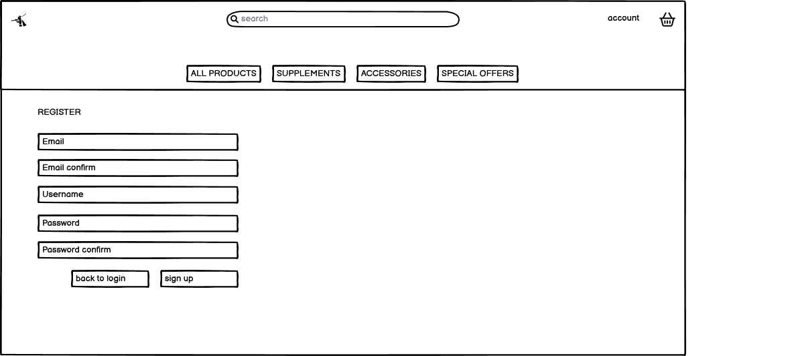

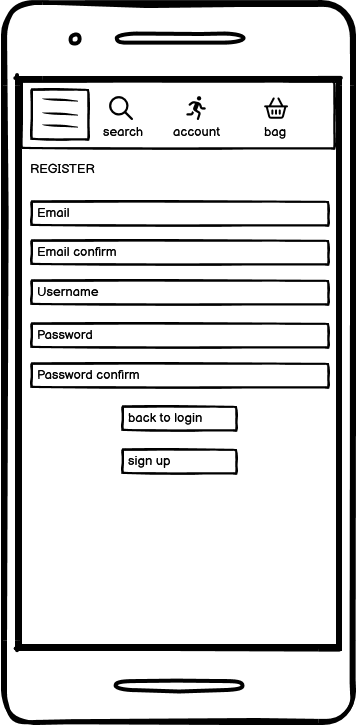

### Database

I opted for ElephantSQL, a relational database built on PostgreSQL, over MongoDB due to the structured nature of my data and project requirements. ElephantSQL's relational model supports clear data relationships, complex queries, and ensures ACID compliance, making it suitable for scenarios where data integrity and consistency are paramount. The mature ecosystem and scalability of PostgreSQL further align with the needs of my application, contributing to a robust and reliable database solution.

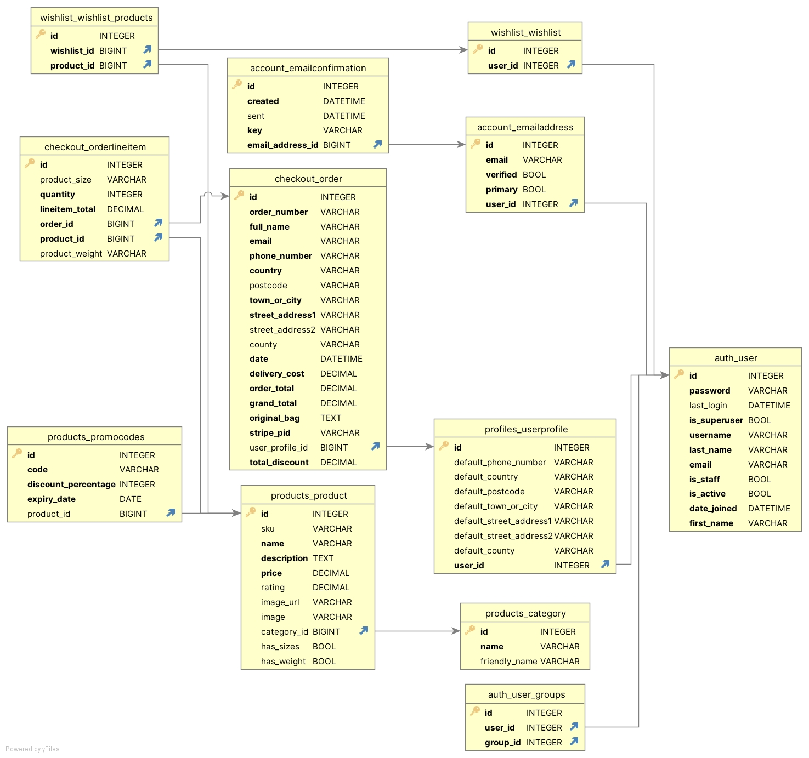

### Colors

Main colours used in the project:

hex#345171 in the background image of the home

hex#800080 for the navbar accents and logo

### Images

-   Imagery used in the project was either pulled from real sources for products or produced by myself such as the backdrop to the home page

# Features

The website has the below features:

## Register and login
* #### The registration page is where users will create an account

    * The page consists of a username field and password field
    * An addition field is available for the user to confirm their password

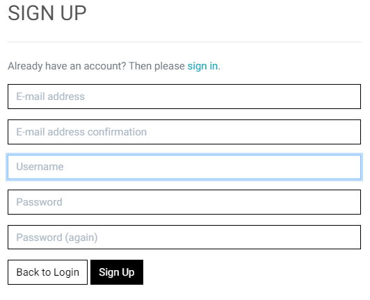

## Products
   * The products page consists of a 4 item width display of products
   * The items can be aranged in multiple different orders including price, rating, name and category

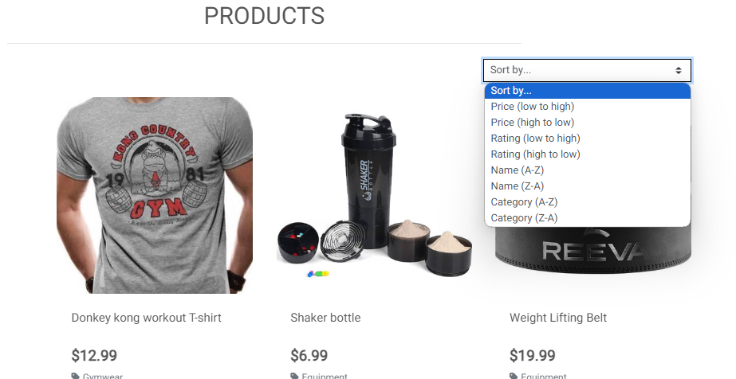

## Product details

   * The products can be viewed in greater detail and with a size select applicable to whether the item is a piece of clothing or has a weight

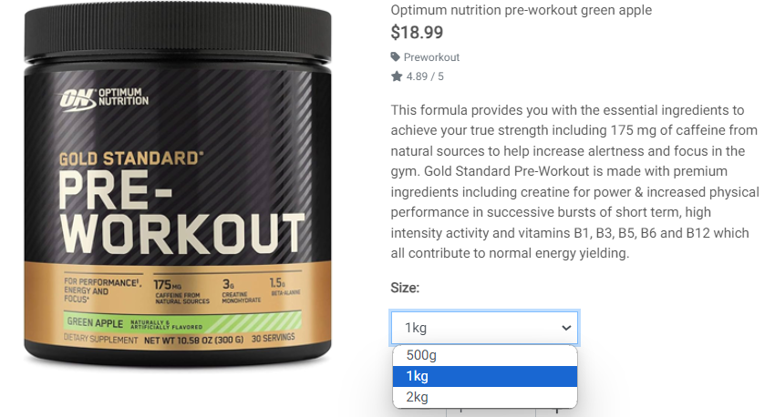

## Wishlist

   * The user is able to add products to a wishlist page for future browsing, where they can move into the product detials or remove the products

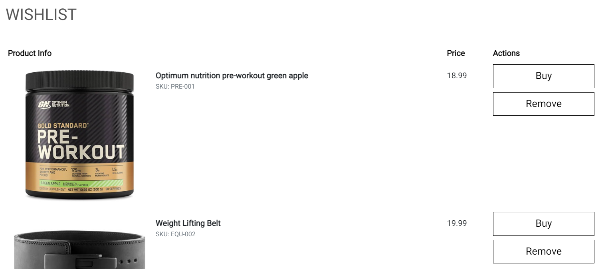

## Bag

   * The bag holds all the the users purchases and can be edited or moved before moving on to the checkout

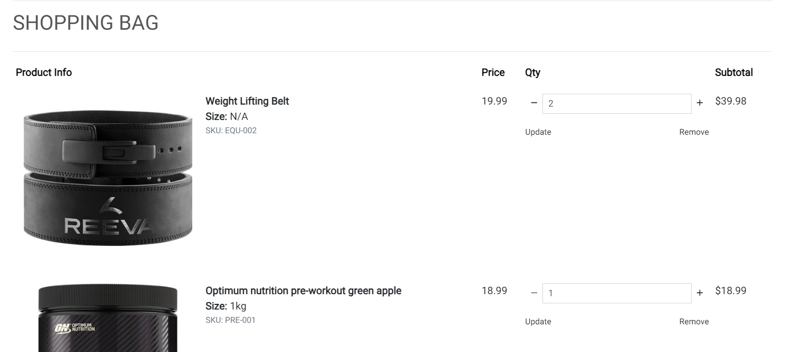

## Profile and purchase history

   * The user has access to a profile where they can modify their personal details and see a history of their past orders

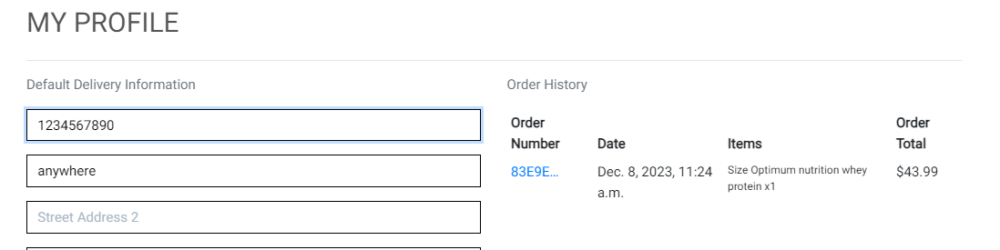

## Promocodes

   * A promo code can be created by an admin and applied to a product with an expiary date that can then be applied to any given product in the database

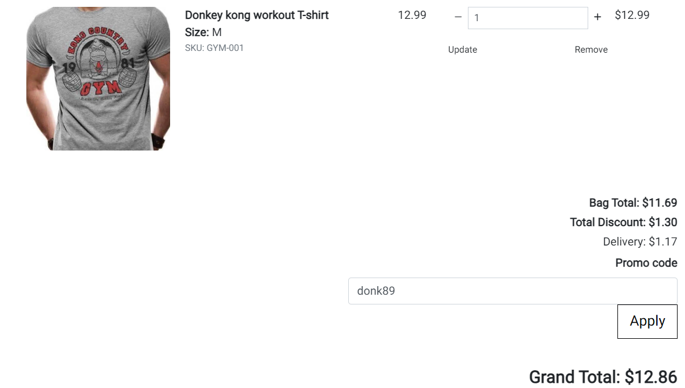

## Confirmation Email

   * The user recieves an automated email to noftify them of the purchase they made complete with details of the products

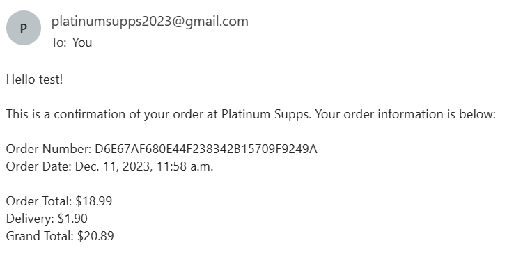

##  Future implementations

* Newsletter

# Technologies 

## Languages

### HTML5
* As a structure language.
### CSS
* As a style language.
### Javascript
* As a style language.
### JQuery
* As a style language.

## Frameworks

### Bootsrap 
* Bootstrap as a CSS framework to keep responsive, mobile first aproach.
### Django
* Django as a high level framework for rapid development and clean, pragmatic design

## Database

### Elephant SQL

* Elephant SQL was chosen as the database for this project

## Project Management

### GitHub
* As a software hosting platform to keep project in a remote location.
### Heroku
* As a platform for hosting the app
### Git
* As a version-control system tracking.
### Gitpod
* As a development hosting platform.

## Tools
### Balsamiq
* As a wireframing tool.
### Photoshop CS2
* As an image editor.
### DB browser (SQLite)
* To aid in navigations and creation of db schema
### Black Python linter
* To facilitate good formatting of python code
### Djlint
* To aid formatting HTML with django
### [CI Python Linter](https://pep8ci.herokuapp.com/#)
* To help in linting the python code to pep8 compliance

# Testing

## Testing

Full details of testing can be found [here](TESTING.md).

# Deployment

I used Gitpod as a development environment where I committed all changes to git version control system.

The application was deployed to heroku for the live site.

## Github Repository

https://github.com/Trollope91/Full-stack-project

## Copying the repository

A user can make a local copy of my repository by going to the GitHub repository page of my project and clicking on the "Code" button which will open a dropdown menu, select the protocol (HTTPS or SSH) for the clone URL and copy it to the clipboard.

Open a terminal on their local machine and navigate to the directory where they want to store the project then type the command "git clone" followed by the URL they copied in step 3, and press Enter.
Wait for the cloning process to complete.

Git will start cloning the repository onto your local machine. Depending on the size of the repository and your internet connection, this may take a moment.

Once the cloning process is complete, you will have a local copy of the GitHub repository in the directory you specified

## Forking the repository

To fork the repository the user can go to the GitHub repository page of the project and click on the "Fork" button in the upper right-hand corner of the page, select the account they want to fork the project to and then wait for GitHub to create a copy of the project in their account.
Once the fork is complete the project will be available under their account with the option to clone to their local machine.

___
# Credits

* To complete this project I used Code Institute student template: [gitpod full template](https://github.com/Code-Institute-Org/gitpod-full-template)

* Ideas and knowledge library:

    * [codeinstitute.net](https://www.codeinstitute.net)

    * [w3schools.com](https://www.w3schools.com)

    * [css-tricks.com](https://css-tricks.com/)

    * [python](https://www.python.org/)

    * [javascript](https://www.python.org/)

    * [django](https://www.djangoproject.com/)

    * [Stack Overflow](https://stackoverflow.com/)

    * [bootstrap](https://getbootstrap.com/)

    * [elephantSQL](https://www.elephantsql.com/)

    * [google fonts](https://fonts.google.com/)
