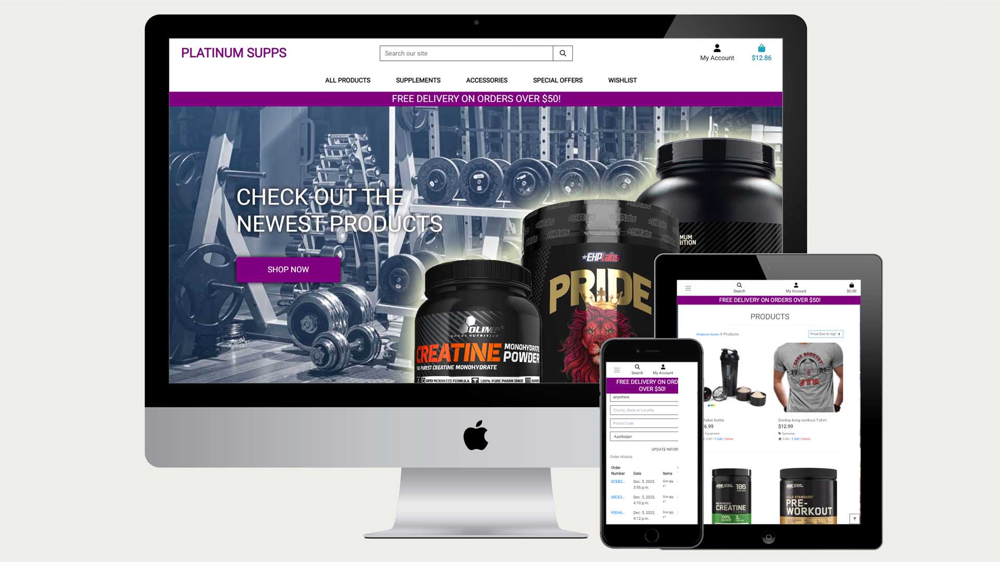
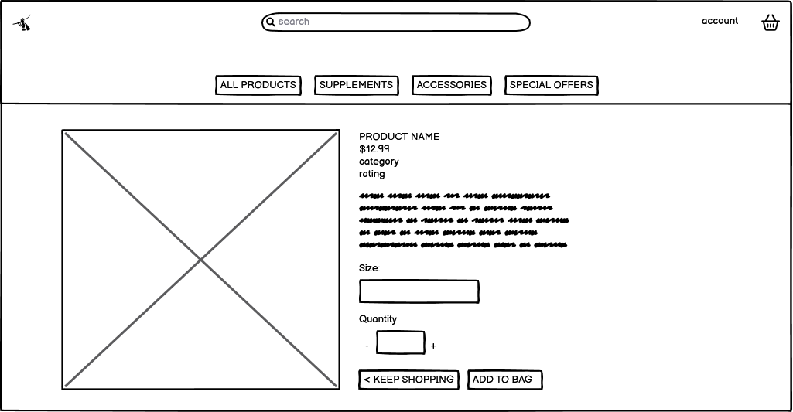
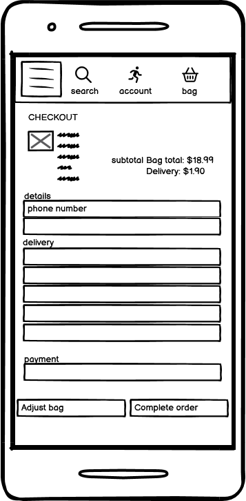
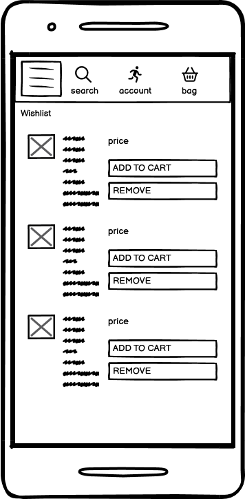
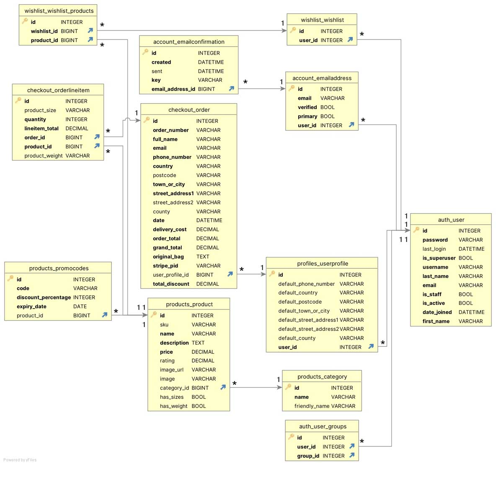

# Platinum Supps

## Code institute milestone project four

**[Deployed site click here](https://platinum-supps-a69b518ec505.herokuapp.com/)**
---

Welcome to Platinum Supps! your fitness ally and premium supplement and gym equipment haven. At Platinum Supps, we're dedicated to fueling your fitness journey with top-quality products. From science-backed supplements to cutting-edge gym gear, we've got your back. embrace the excellence, and let's achieve your fitness goals together. Welcome to Platinum Supps – where strength meets style!

Features

1. Profile Creation
   Create a profile that will hold you personal details for sales and products

2. Product browsing
   Search through the sites wares with easy navigation and filters that allow you to display by multiple factors such as price or rating

3. Search bar
   Search through the entire database of products for specifc values such as name or even things mentioned in the descriptio 

4. Admin controls
   When set up as an admin control the products on display with the ability to delete or edit products details and images

5. checkout
   make fast payments with stripe checkout handling credit card and billing details

6. Promo codes
   Add a discount to specific products with promocodes that you can set and apply

7. Wish list
   Add products to a wish list for future browsing and purchase

8. Email
   Recieve an automated email upon purchase containing the information of your purchase
   

### User Stories

### As a new customer:

- Understand the purpose of the site as soon as it loads
- Easily browse the products on the site
- Create an account
- Learn about a products detials
- Search through the database of products 
- Add products to a wish list
- Choose the size of product that im purchasing
- View my previous purchases
- Recieve a confirmation for my order
- See which products are on sale or clearence
- Check my basket before checking out
- Be able to create a new account as simply as possible taking a username and password 
- save my default information for future purchases

### As the business owner:

- Be able to add new products to the site as well as edit existing ones
- Have a way to implement discount codes for certain products
- have a simple payment structure

### Strategy

Create a fully functional e-commerce website that will provide the means to create an account, browse through a variety of products in different categories and add them to a basket for purchase.

as well as add those products to a wishlist and have the option to apply promo codes at checkout

## Structure of the website

Platinum supps comprises of a homepage that grants acccess to all areas of the site, a Registration page that allows a user to make an account that will track their details and purchases.

a wishlist that the user can save specific products too and a bag/checkout that will calculate the total of the purchase, workout whether it qualifies for free delivery and then handles creditcard payments

## Wireframes

I used balsamiq to create the initial wireframes.

### Home Wireframes

### Products Wireframes

### Product Details Wireframes

### Bag Wireframes

### Checkout Wireframes

### Wishlist Wireframes

### Profile Wireframes

### Registration Wireframes

### Database

I opted for ElephantSQL, a relational database built on PostgreSQL, over MongoDB due to the structured nature of my data and project requirements. ElephantSQL's relational model supports clear data relationships, complex queries, and ensures ACID compliance, making it suitable for scenarios where data integrity and consistency are paramount. The mature ecosystem and scalability of PostgreSQL further align with the needs of my application, contributing to a robust and reliable database solution.

## Key Models

### User
* created on registration 
* holds information 

### Product
* Holds data relating to the individual products such as name, descriction etc
* User is able to set Size or Weight here as well as rating
* Image url is also handled by this model

### Promocodes
* promocodes relate to the product as a many to one
* it constains the code itself to be set by admin that can then be applied to the specific product in the checkout
* it also contains data for a code expiry date

### Wishlist
* the wish list model contains the data relating the user to the products contained within it

### Orders
* holds the specific data of each order
* tied to the user in a many to one relationship

# color palette and imagery

## Colors

Main colours used in the project:

hex#345171 in the background image of the home

hex#800080 for the navbar accents and logo

## Images

-   Imagery used in the project was either pulled from real sources for products or produced by myself such as the backdrop to the home page
- Real products were used for the images in the database

# Features

The website has the below features:

## Register and login
* #### The registration page is where users will create an account

    * The page consists of a username field and password field
    * An addition field is available for the user to confirm their password

## Products
   * The products page consists of a 4 item width display of products
   * The items can be aranged in multiple different orders including price, rating, name and category

## Product details

   * The products can be viewed in greater detail and with a size select applicable to whether the item is a piece of clothing or has a weight

## Wishlist

   * The user is able to add products to a wishlist page for future browsing, where they can move into the product detials or remove the products

## Bag

   * The bag holds all the the users purchases and can be edited or moved before moving on to the checkout

## Profile and purchase history

   * The user has access to a profile where they can modify their personal details and see a history of their past orders

## Promocodes

   * A promo code can be created by an admin and applied to a product with an expiary date that can then be applied to any given product in the database

## Confirmation Email

   * The user recieves an automated email to noftify them of the purchase they made complete with details of the products

##  Future implementations

* Newsletter

# Technologies 

## Languages

### HTML5
* As a structure language.
### CSS
* As a style language.
### Javascript
* As a style language.
### JQuery
* As a style language.

## Frameworks

### Bootsrap 
* Bootstrap as a CSS framework to keep responsive, mobile first aproach.
### Django
* Django as a high level framework for rapid development and clean, pragmatic design

## Database

### Elephant SQL

* Elephant SQL was chosen as the database for this project

## Project Management

### GitHub
* As a software hosting platform to keep project in a remote location.
### Heroku
* As a platform for hosting the app
### Git
* As a version-control system tracking.
### Gitpod
* As a development hosting platform.

## Tools
### Balsamiq
* As a wireframing tool.
### Photoshop CS2
* As an image editor.
### DB browser (SQLite)
* To aid in navigations and creation of db schema
### Black Python linter
* To facilitate good formatting of python code
### Djlint
* To aid formatting HTML with django
### [CI Python Linter](https://pep8ci.herokuapp.com/#)
* To help in linting the python code to pep8 compliance

# Testing

Full details of testing can be found [here](TESTING.md).

# Deployment

Prerequisites

Python 3

PIP 

Git 

Amazon AWS S3 Bucket

## Github Repository

https://github.com/Trollope91/Full-stack-project

## Copying the repository

Navigate to the repository and click on "Code." In the Clone HTTPS section, copy the repository's clone URL.

Open Git Bash in your local Integrated Development Environment (IDE). Change the current working directory to the desired location for the cloned directory.

Use the command "git clone" followed by pasting the URL

Create an env.py file that will require the following variables in order to function 

* import os
* os.environ.setdefault("SECRET_KEY", "your key")
* os.environ.setdefault("DEVELOPMENT", "True")
* os.environ.setdefault('STRIPE_PUBLIC_KEY', 'your key')
* os.environ.setdefault('STRIPE_SECRET_KEY', 'your key')
* os.environ.setdefault('STRIPE_WH_SECRET', 'your key')

you secret and public stripe keys will need to be taken from your personal account under the developers tab with the wh key being found inside the webhook

To set up the application, begin by installing the necessary dependencies with the command pip3 install -r requirements.txt.

Afterward, apply database migrations by executing python manage.py migrate.

Create a new superuser and input the required details using python manage.py createsuperuser.

With these configurations in place, you can run the application locally by executing python manage.py runserver.

# Setting up a Bucket

Begin by creating an Amazon AWS account and navigating to S3 to initiate the creation of a new bucket. Allow public access and confirm the acknowledgment.

In the Properties section, enable Static website hosting, set Index.html as the index document, and save the settings.

Configure Cross-Origin Resource Sharing (CORS) under Permissions using the specified rules.

Proceed to create a Bucket Policy by generating it and noting the Bucket ARN. Choose S3 Bucket Policy as the policy type, enter "*" for Principal, and add a statement.

Generate the policy, copy the JSON document, and paste it into the Edit Bucket policy tab. Save the changes.

In the Access Control List (ACL) section, enable public access by checking the List option for Everyone, accepting that the bucket is accessible worldwide. Confirm and save the changes.

# Setting up acces and indentity management

Navigate to the IAM dashboard within AWS and select "User Groups." Create a new group and proceed without adding a policy initially.

After creating the group, select "Policies" and create a policy. In the JSON tab, import the managed policy "AmazonS3FullAccess." Modify the resource to include the Bucket ARN from the earlier creation of the Bucket Policy, specifying both the bucket itself and its contents.

Proceed to the next step and review the policy, providing it with a name and a description before creating the policy.

Return to User Groups, choose the previously created group, and under Permissions, add permissions by attaching the newly created policy.

Under Users, create a user with a chosen name and proceed to the next steps. Add the user to the previously created group, review the configuration, and create the user.

Ensure to download the provided .csv file containing the access key and secret access key, emphasizing that this download option will not be available again.

# Connect django to s3

Install the following packages

* pip3 install django-storages
* pip3 install boto3
* pip3 freeze > requirements.txt

Include the values from the downloaded .csv file in your Heroku Config Vars

Remove the DISABLE_COLLECTSTATIC variable from your Config Vars and proceed to deploy your Heroku app. With your S3 bucket configuration completed, establish a new folder named "media" (at the same level as the recently added "static" folder). Upload necessary media files to this folder, ensuring they have public accessibility under Permissions.

___
# Credits

* To complete this project I used Code Institute student template: [gitpod full template](https://github.com/Code-Institute-Org/gitpod-full-template)

* Ideas and knowledge library:

    * [codeinstitute.net](https://www.codeinstitute.net)

    * [w3schools.com](https://www.w3schools.com)

    * [css-tricks.com](https://css-tricks.com/)

    * [python](https://www.python.org/)

    * [javascript](https://www.python.org/)

    * [django](https://www.djangoproject.com/)

    * [Stack Overflow](https://stackoverflow.com/)

    * [bootstrap](https://getbootstrap.com/)

    * [elephantSQL](https://www.elephantsql.com/)

    * [google fonts](https://fonts.google.com/)
