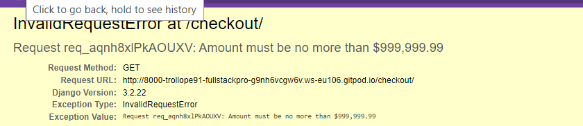
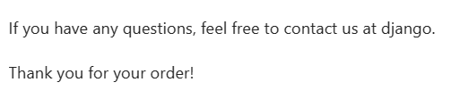

Back to [README](README.md)

## Functionality testing 

 I used Chrome developer tools throughout the project for testing and solving problems with responsiveness and style issues.

### Responsive test

 

## Compatibility testing
 Site was tested across multiple virtual mobile devices and browsers. I checked all supported devices in Chrome developer tools. 
 
 I tested on hardware devices such as: Dell Latitude with Windows OS's, Huawei P30 smartphone with Android OS on google chrome browser and samsung A7 lite with Android OS.

## User stories testing

### As a new customer: 

-   Understand the purpose of the site as soon as it loads
      > the site instantly loads into a home with clearly labeled links and images denoting what the website is for and where the user can go to achieve there goals
-   Easily browse the products on the site
      > the site is well labelled with multple categories adapting the product page with filters that display all manner of products
-   Create an account
      > the user is able to easily and quickly create an account by putting in their email, personal, details and password
-   Learn about a products detials
      > clciking on a product leads to a product detail page with a full description of the product on offer
-   Search through the database of products 
      > the site has a search bar that can brwose through all the products in the database pulling from the names and descriptions
-   Add products to a wish list
      > the site allows users to put any product into a wishlist for quick access and addition to the bad at a later date
-   Choose the size of product that im purchasing
      > the products have a size dropbox that can be altered between traditional sizes for clothes or weights for products that come in a variety of weights
-   View my previous purchases
      > the user has access to a profile page that will display previous orders
-   Recieve a confirmation for my order
      > the user will be sent an email upon purchase that will contain the details if the purchase made
-   See which products are on sale or clearence
      > there is a category for products that have been marked down in price or are currently on offer
-   Check my basket before checking out
      > the site has a bag page that contains all products selected by the user before checking out
-   save my default information for future purchases
      > the checkout page will retain order information for future orders and autofill

### As the site owner:

-   Be able to add new products to the site as well as edit existing ones
      > the site has product management features for superusers and admin that allows them to add, edit and remove products within the site
-   Have a way to implement discount codes for certain
      > the site allows for admins to set promo codes with an expiry date that can be applied to individual products
-   have a simple payment structure
      > there is a straight forward and easy process for inputting personal and payment details via stripe

# Issues found during site development

## Home page
* search bar does not find products by description
* bag icon does not display price of current products

## Bag
* updating products with weight category crashes checkout
* email reply will not take variable from py.env defaulting to "django"
* mobile view quanitity buttons function but desktop does not
* promocode application will not submit in desktop view
* html is broken in mobile view
* user is able to enter and submit an amount the breaks the checkout

# Checkout
* email confirmaiton will not send 
* user details will not retain
* automated email sender address defaults to "django"

## Manual testing

**Sign up and login**
* register link functions - Does not funciton in mobile view
* register function works correctly - YES
* mismatched email doesn't allow progress - YES
* mismatched email displays error message - YES
* invalid email format gives error - YES
* mismatched password displays error - YES
* log out link funcitons correctly - YES
* signing out functions correctly - YES

**Profile**
* displays correct information tied to user number - YES
* update function works as inteded - YES
* order history displays correct informatio - YES
* order history links go to correct orders - YES

**navbar**

* logo link goes back to home page - YES
* dropdown navigation functions correctly - YES
* dropdown navigation contains all relevant information - YES
* all links within navigation operate correctly - YES
* discount banner displays correct amount - YES
* my account drop down displays links for admin and non admin user - YES
* bag link operates correctly - YES
* live price update functions correctly - YES
* search bar recieves relevant results based on name or description - YES

**products**

* product data is displayed correctly for each product - YES
* sort by price ascending functions correctly - YES
* sort by price descending functions correctly - YES
* sort by rating ascending functions correctly - YES
* sort by rating descending functions correctly - YES
* sort by name ascending functions correctly - YES
* sort by name descending functions correctly - YES
* sort by category ascending functions correctly - YES
* sort by category descending functions correctly - YES
* deleting product functions correctly - YES
* editing product details updates correctly - YES
* removing image functions correctly - YES
* uploading a new image functions correctly - YES
* toast message alert displays when editing product - YES

**product details**

* product details have relevant data - YES
* size option displays correctly - YES
* quantity field displays correctly - YES
* qunatity field cannot exceed 99 or go below 0 - YES
* error message on quantity field displays - YES
* product details display correctly in toast - YES
* add to bag link functions correctly - YES
* keep shopping links functions correctly - YES

**bag**

* toast triggers when adding to bag - YES
* toast displays relvant order information - YES
* link to bag functions in toast - YES
* bag page displays correct information - YES
* price update functions correctly - YES
* update toast functions correctly - YES
* adding the upper limit of number is handled correctly - breaks the bag page (FIXED)
* remove function works correctly - YES
* bag total updates correctly - YES
* delivery updates correctly - YES
* grand total updates correctly - YES
* Return and checkout links function - YES
* product info displays correctly - YES
* free delivery display works correctly - YES
* promocode field functions correctly - promocode only functioned in mobile view (FIXED)
* promocode discount is applied correctly - YES

**checkout**

* product information is correct - YES
* order total is correct - YES
* delivery is calculated correctly - YES
* grand total is calculated correclty - YES
* users detais are retained from past orders - YES
* checking out functions correctly - YES
* automated email is sent out - FAIL - FIXED (FIXED)
* automated email pulls correct details to body - email has erroneous sender mail "django"

**wishlist**

* products can be added to wishlist - YES
* products can be removed from wishlist - YES
* products are linked backed to product view - YES
* wishlist page is not accessible without logging in - YES
* add to wish list button is accessible to user without an account - YES

## Automated testing

I ran [Lighthouse](https://developers.google.com/web/tools/lighthouse/) tool to check performance of the website.

**Home page**

- Performance:
- Accessibility:
- Best Practices:
- SEO: 

**Products**

- Performance:
- Accessibility:
- Best Practices:
- SEO: 

**Profile**

- Performance:
- Accessibility:
- Best Practices:
- SEO: 

**Register**

- Performance:
- Accessibility:
- Best Practices:
- SEO: 

**Bag**

- Performance:
- Accessibility:
- Best Practices:
- SEO: 

**Checkout**

- Performance:
- Accessibility:
- Best Practices:
- SEO:

**Wishlist**

- Performance:
- Accessibility:
- Best Practices:
- SEO: 

I checked accessibility with [Wave Extension](https://wave.webaim.org/extension/) tool to check performance of the website.

## Code Validation
 At the and of the project I used two websites to validate a code
 
 ### [W3C CSS Validator]() to validate CSS

* CSS checked - no errors

### [Nu Html Checker](https://validator.w3.org/) to test HTML

* Home page - no errors
* Products - no errors
* Products description - no errors
* Bag - no errors
* Checkout - no errors
* Wishlist - no errors

###  [jshint](https://jshint.com/) To error check 

* No errors pretaining to the javascript through out the site

###  [CL Pythno Linter](https://pep8ci.herokuapp.com/#) To format python code to pep 8 compliance

* All python code was adjusted to comply the pep8 standards
